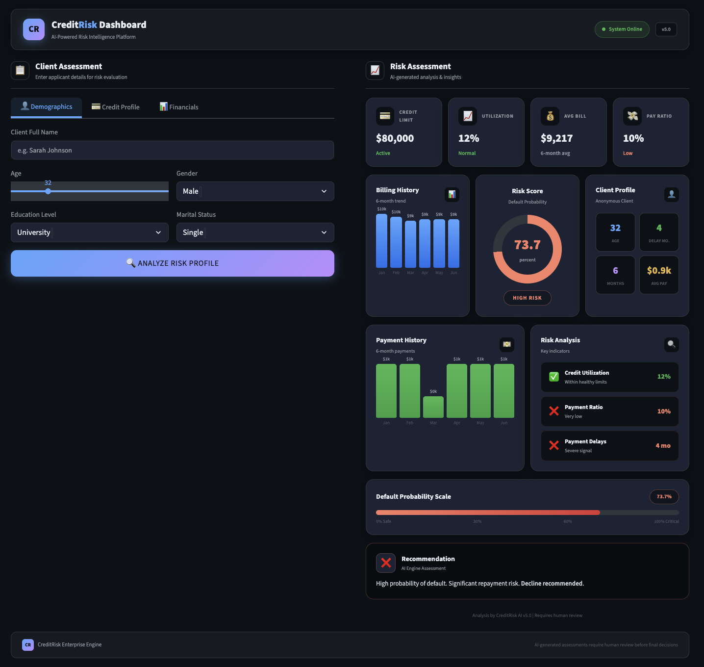
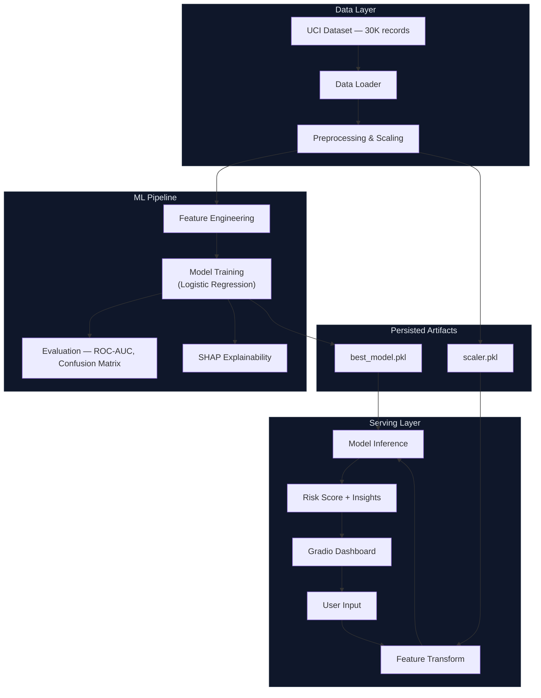

# Credit Risk Analyzer

**Explainable Machine Learning Lending System**

An end-to-end machine learning system that predicts credit card default risk, provides explainable AI insights via SHAP, and serves real-time decisions through a production-grade Gradio dashboard — built to mirror how fintech lending teams actually evaluate borrowers.

---

## Problem Statement

Consumer credit default costs financial institutions billions annually. Traditional rule-based underwriting misses complex, non-linear patterns in borrower behavior — patterns that machine learning captures effectively.

This project builds a **complete credit risk pipeline**: from raw transaction data to a deployable web interface that a lending analyst could use to evaluate a client in under 30 seconds, with full model transparency and explainability.

---

## Demo

<p align="center">
  
</p>

---

## Features

- **Full ML Pipeline** — data ingestion, feature engineering, preprocessing, model training, evaluation, and serving
- **Explainability** — SHAP-based feature importance analysis for every prediction (why did the model decide this?)
- **Production UI** — dark-themed fintech dashboard built with Gradio, responsive and deployment-ready
- **Engineered Features** — 8 derived financial indicators (credit utilization, payment ratio, delay severity, bill trends)
- **Data-Driven Insights** — automated risk factor analysis explaining each prediction with color-coded reasoning
- **Deployment-Ready** — environment variable configuration, absolute path resolution, single-command launch

---

## Tech Stack

| Layer | Technology |
|---|---|
| Language | Python 3.12 |
| ML Framework | scikit-learn |
| Explainability | SHAP |
| Web UI | Gradio (Blocks API) |
| Data | Pandas, NumPy |
| Serialization | Joblib |
| Dataset | UCI Taiwan Credit Card Default (30,000 records) |

---

## System Design



---

## Project Structure

```
credit-risk-analyzer/
├── notebooks/
│   ├── 01_eda.ipynb                          # Exploratory data analysis
│   ├── 02_preprocession_feature_scaling.ipynb # Preprocessing & scaling
│   ├── 03_model_training.ipynb               # Model training & evaluation
│   └── 04_shap_explainability.ipynb          # SHAP feature importance
├── src/
│   ├── data.py                               # Data loading utilities
│   ├── features.py                           # Feature engineering (8 derived features)
│   ├── preprocess.py                         # Preprocessing & scaling pipeline
│   ├── train.py                              # Model training script
│   └── predict.py                            # Inference utilities
├── models/
│   ├── best_model.pkl                        # Trained Logistic Regression model
│   └── scaler.pkl                            # Fitted StandardScaler
├── app/
│   └── app.py                                # Gradio dashboard (single-file, self-contained)
├── data/
│   ├── credit_card_default_dataset.csv       # Raw UCI dataset
│   └── processed_data.pkl                    # Preprocessed feature matrix
├── screenshots/
│   └── ui.png                                # Dashboard screenshot
├── requirements.txt
└── README.md
```

---

## Machine Learning Pipeline

```
Raw Data (30K records, 24 features)
    │
    ▼
┌─────────────────────────────┐
│  Feature Engineering        │
│  + AVG_BILL_AMT             │
│  + CREDIT_UTILITY           │
│  + AVG_PAY_DELAY            │
│  + PAYMENT_TO_BILL          │
│  + MAX_PAY_DELAY            │
│  + NUM_LATE_MONTHS          │
│  + PAYMENT_STD              │
│  + SEVERE_DELAY_FLAG        │
└─────────────────────────────┘
    │
    ▼
Preprocessing (One-Hot Encoding + Standard Scaling)
    │
    ▼
Model Training (Logistic Regression — selected via cross-validation)
    │
    ▼
Evaluation (ROC-AUC, Confusion Matrix, Classification Report)
    │
    ▼
SHAP Explainability (Global + Local Feature Importance)
    │
    ▼
Gradio Dashboard (Real-Time Prediction + Data-Driven Insights)
```

---

## Model Performance

| Metric | Score |
|---|---|
| **ROC-AUC** | ~0.75 |
| **Algorithm** | Logistic Regression |
| **Training Set** | 30,000 records (UCI Taiwan Credit) |

**Interpretation:** A ROC-AUC of 0.75 indicates the model correctly ranks a random defaulter above a random non-defaulter 75% of the time. While not production-threshold for autonomous decisions, it provides strong directional guidance for human-in-the-loop lending workflows.

---

## Installation & Setup

**Prerequisites:** Python 3.10+

```bash
# 1. Clone the repository
git clone https://github.com/<your-username>/credit-risk-analyzer.git
cd credit-risk-analyzer

# 2. Create virtual environment
python -m venv venv
source venv/bin/activate        # macOS/Linux
# venv\Scripts\activate         # Windows

# 3. Install dependencies
pip install -r requirements.txt
```

---

## Usage

### Run the Dashboard

```bash
python app/app.py
```

Opens at **http://localhost:7860**

### Run the Notebooks

Execute in order for full pipeline reproduction:

```bash
jupyter notebook notebooks/
```

1. `01_eda.ipynb` — data exploration and visualization
2. `02_preprocession_feature_scaling.ipynb` — preprocessing pipeline
3. `03_model_training.ipynb` — model training and evaluation
4. `04_shap_explainability.ipynb` — SHAP analysis

### Retrain the Model

```bash
python src/train.py
```

---

## Future Improvements

- **Threshold Optimization** — tune decision threshold using precision-recall tradeoff for business-specific cost matrices
- **Model Upgrades** — experiment with XGBoost, LightGBM, and neural networks for improved AUC
- **Cloud Deployment** — containerize with Docker, deploy to Render / HuggingFace Spaces
- **Monitoring** — add prediction drift detection and model performance tracking
- **Batch Processing** — CSV upload for bulk risk assessment
- **API Layer** — FastAPI endpoint for programmatic integration

---

## Key Highlights

> Designed for recruiters and reviewers scanning in 30 seconds.

- End-to-end ML system: data → features → model → explainability → UI
- Engineered 8 domain-specific financial features from raw transaction data
- SHAP-powered explainability — not just predictions, but *why*
- Production-grade Gradio dashboard with dark fintech aesthetic
- Clean, modular codebase with separated concerns (src / app / notebooks)
- Deployment-ready with environment variable configuration

---

## License

This project is open-source under the [MIT License](LICENSE).

---

## Author

**Satyam Kumar**

- GitHub: [@SatyamKumarCS](https://github.com/SatyamKumarCS)
- Project: [Credit Risk Analyzer](https://github.com/SatyamKumarCS/Default-Credit-Card-Prediction)
